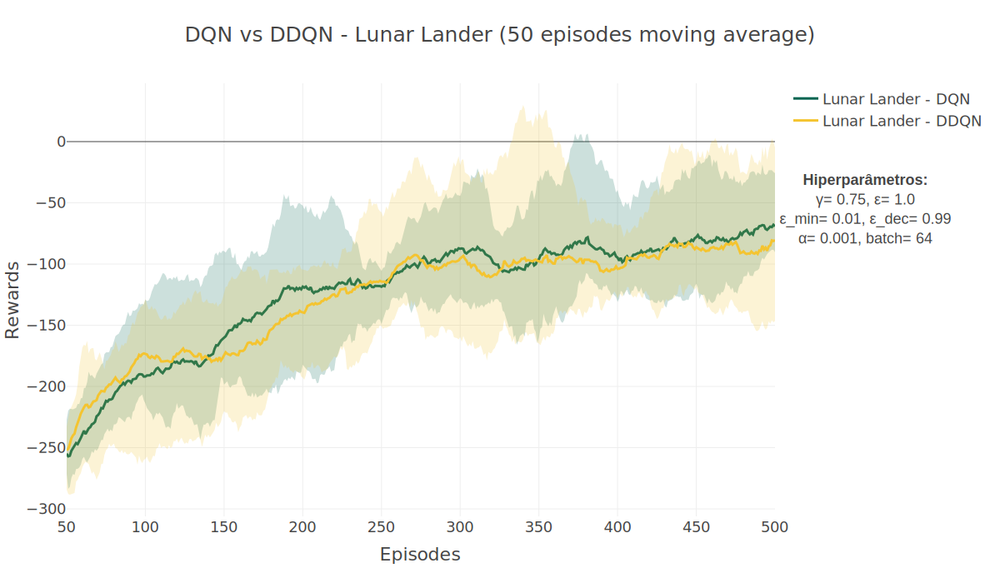

# Projeto Intermediário: Double Deep Q-Learning vs Deep Q-Learning Network no aprendizado de agentes em ambientes de Reinforcement Learning

## Developers

<table>
  <tr>
    <td align="center"><a href="https://github.com/gianvr"> <b>Giancarlo Ruggiero</b></a>  Developer</td>
   <td align="center"><a href="https://github.com/talesitf"> <b>Tales Ivalque</b></a> Developer</td>
   <td align="center"><a href="https://github.com/FelixLuciano"> <b>Luciano Felix</b></a>  Developer</td>
  </tr>
</table>

## Descrição do Projeto

O projeto consiste em comparar o desempenho de dois algoritmos de aprendizado por reforço, o Deep Q-Learning Network (DQN) e o Double Deep Q-Learning (DDQN), em dois ambientes de simulação distintos: o CartPole e o LunarLander. O objetivo é avaliar a eficácia do DDQN em relação ao DQN, considerando a estabilidade e a eficiência do aprendizado dos agentes em ambientes de Reinforcement Learning.

# Descrição dos Ambientes

## CartPole
Este ambiente corresponde à versão do problema do pêndulo invertido descrito por Barto, Sutton e Anderson em "Elementos Adaptativos Semelhantes a Neurônios Que Podem Resolver Problemas Complexos de Controle de Aprendizado". Um pêndulo é conectado por uma junta não atuada a um carrinho, que se move ao longo de uma pista sem atrito. O pêndulo é colocado em pé sobre o carrinho e o objetivo é equilibrar o pêndulo aplicando forças na direção esquerda e direita sobre o carrinho.

##### Espaço de Ação
A ação é um ndarray com formato (1,) que pode assumir os valores {0, 1}, indicando a direção da força fixa com a qual o carrinho é empurrado.

- 0: Empurrar o carrinho para a esquerda

- 1: Empurrar o carrinho para a direita

##### Espaço de Observação

A observação é um ndarray com formato (4,) com os valores correspondentes às seguintes posições e velocidades:

- 0: Posição do carrinho
- 1: Velocidade do carrinho
- 2: Ângulo do pêndulo
- 3: Velocidade angular do pêndulo

A posição x do carrinho (índice 0) pode assumir valores entre (-4.8, 4.8), mas o episódio termina se o carrinho sair do intervalo (-2.4, 2.4).

O ângulo do pêndulo pode ser observado entre (-.418, .418) radianos (ou ±24°), mas o episódio termina se o ângulo do pêndulo não estiver no intervalo (-.2095, .2095) radianos (ou ±12°).

## LunarLander

Este é um ambiente do clássico problema de otimização de trajetória de foguete.
De acordo com o
[princípio máximo de Pontryagin](https://pt.wikipedia.org/wiki/Princ%C3%ADpio_m%C3%ADnimo_de_Pontryagin),
é ideal ligar o motor a toda velocidade ou desligá-lo. Por esta razão este
ambiente possui ações discretas: ligar ou desligar os motores.

A plataforma de pouso está sempre nas coordenadas (0, 0). As coordenadas são os
dois primeiros números do vetor de estado. É possível pousar fora da plataforma
de pouso. O combustível é infinito, então um agente pode aprender a voar e
pousar na primeira tentativa.

##### Espaço de Ação

O espaço de observação é discreto com 4 ações distintas. Dentre elas:

- 0: Fazer nada;
- 1: Dispara o motor de orientação à esquerda;
- 2: Dispara o motor de propulsão principal;
- 3: Dispara o motor de orientação à direita.

##### Espaço de observação

O estado é um vetor de 8 dimensões:

- As coordenadas do módulo de pouso em x e y;
- as velocidades lineares em x e y;
- o ângulo da espaçonave em relação ao solo;
- a velocidade angular;
- e dois booleanos que representam se cada perna está em contato com o solo.

## Metodologia

Para avaliar o desempenho dos algoritmos DQN e DDQN, foram realizados experimentos em dois ambientes de simulação distintos: CartPole e LunarLander, rodando cada algoritmo 5 vezes para cada ambiente. Os experimentos foram realizados com 300 episódios de treinamento para o CartPole e 500 episódios para o LunarLander. 

## Resultados

### CartPole

### LunarLander

## Conclusão

Em ambos os ambientes de simulação, os dois algoritmos atingiram recompensas similares, com poucas diferenças entre si. No entanto, como pode ser visto no caso do CartPole, o DDQN apresentou uma variação muito menor que o DQN, o que indica que o DDQN é mais estável e consistente no aprendizado do agente. No entanto, para casos onde o agente dá pouca importância para recompensas futuras (gamma baixo), o DDQN não apresentou vantagens significativas em relação ao DQN.
